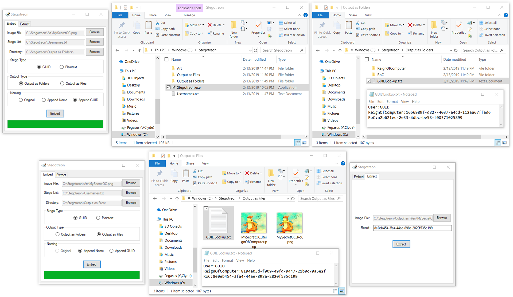

# Stegotreon

> Signs image files to catch naughty leakers ;)

## Description

Download: https://github.com/ReignOfComputer/Stegotreon/releases

Stegotreon takes a PNG file and a line-separated text file, then automatically generates files with text hidden inside through steganograpy.

Artists on Patreon (and elsewhere) have an issue where their art is leaked outside the paywall. Some have resorted to sending image files directly to patrons, though leaks still happen. Stegotreon creates unique variants of the image file that can be reversed to identify the leaker, even if the file name is changed.

<p align="center">  </p>

## Usage

1. Browse to the Image File.
2. Browse to the TXT File containing unique identifiers (e.g. usernames, emails).
3. Change the Save directory if necessary.
4. Select a Steganograpy type: **GUID** generates a unique identifier (e.g. 68dcd06e-a7b5-4a28-93be-612035b1d515). This is good because it doesn't reveal any PII (Personally Identifiable Information), and is confusing if someone does try to reveal the text. If GUID is selected (default), a text file with GUID:Name pairs will be generated for lookup. **Plaintext** will just simply hide the name as supplied in the TXT file in the image.
5. Select an Output type: **Output as Folders** will generate a folder for each identifier in the TXT file. **Output as Files** will generate the image files in the working directory with the identifier (first 8 characters in the case of GUID) appended at the end of the filename.
6. Select a Naming type: **Original** just uses the original filename of the image. Only available for Output as Folders. **Append Name** will append the full identifier from the TXT file at the end of the filename (e.g. Filename_RoC.png). **Append GUID** will append the first 8 characters of the GUID at the end of the filename (e.g. Filename_68dcd06e.png), for lookup in GUIDLookup.txt in the future.
7. Embed!

Suggested Settings:
> Stego Type - GUID | Output Type - Output as Folders | Naming Type - GUID

## TXT File

The Stego List TXT file should just be a .txt file (which can be generated in Notepad) that has entries on each line, such as:

```
Username1
Username2
Username3
email1@example.com
email2@example.com
email3@example.com
```

If the records are in Excel, you can select the entire column and paste it into Notepad and that should do the trick.

## Extraction

1. Hit the Extract Tab.
2. Browse to the Image File.
3. Extract!

## Limitations

1. Steganograpy is easily defeated if any post-processing is done to the image, especially if it is compressed or converted to JPEG.
2. While this tool drastically decreases the time it takes to process batch steganograpy, it is still very time consuming to send the files.
3. No error handling exists - expect errors if you don't use the tool right.
4. This tool only handles PNG-24 (.png) files.

## Did It Work?

Let me know! Twitter: @ReignOfComputer

## License

[MIT License](https://github.com/ReignOfComputer/Stegotreon/blob/master/LICENSE) | &copy; 2019 ReignOfComputer

## Credits

Steganograpy Logic is taken from ktekeli's [img-stego](https://github.com/ktekeli/img-stego/).